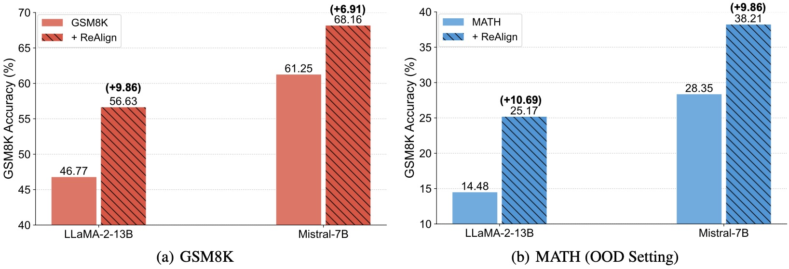
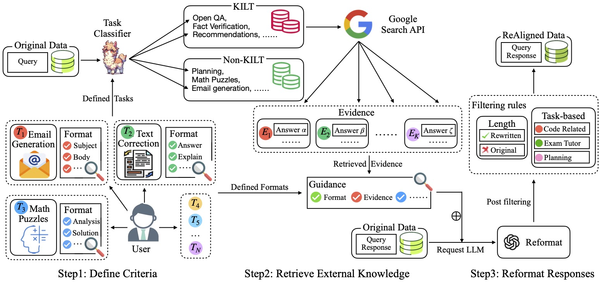
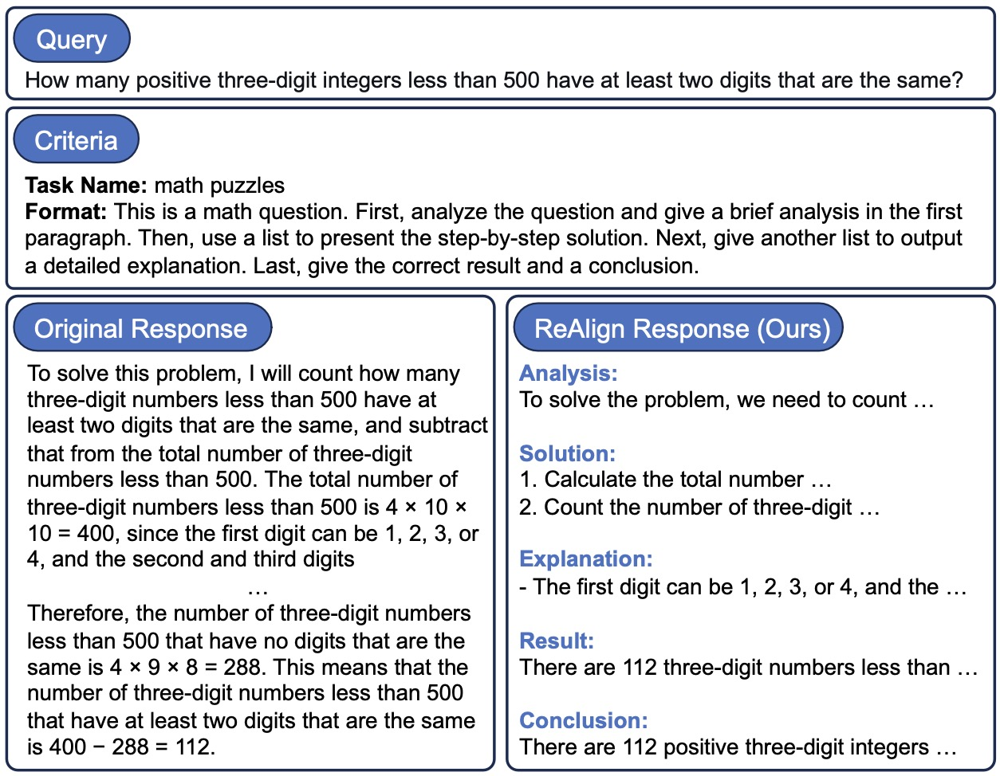
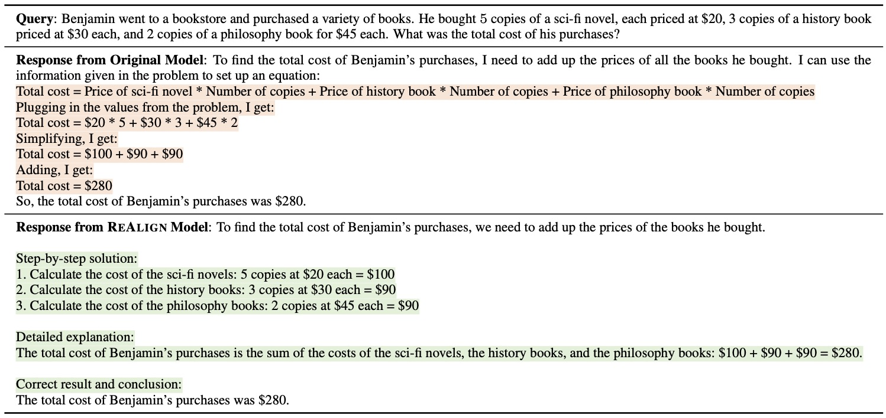

# Reformatted Alignment
This is the official repository for [**Reformatted Alignment**](https://arxiv.org/abs/xxx).

[Run-Ze Fan](https://scholar.google.com/citations?user=mhot7AUAAAAJ&hl=en), [Xuefeng Li](https://github.com/hongtangshui), [Haoyang Zou](https://openreview.net/profile?id=~Haoyang_Zou1), [Junlong Li](https://lockon-n.github.io/), [Shwai He](https://shwai-he.github.io/), [Ethan Chern](https://ethanc111.github.io/), [Jiewen Hu](https://www.linkedin.com/in/jiewen-hu/), [Pengfei Liu](http://pfliu.com/)

## News
- **Feb 2024**: We release the preprint paper on Arxiv, ReAlign data, and other useful resources in developing them (tasks description, hand-written format, tasks classifier, training data, and NQ dataset for factuality evaluation).

## Table of contents

- [Introduction](#Introduction)
- [Quick Start](#quick-start)
  - [Setup](#setup)
  - [Pipeline](#pipeline)
- [ReAlign Dataset](#realign-dataset)
- [Other Resources](#other-resources)
  - [Tasks Description and Formats](#tasks-description-and-formats)
  - [The Data for Task Classifier](#the-data-for-task-classifier)
  - [Factuality Evaluation: NQ Dataset](#factuality-evaluation)
- [Citation](#citation)
- [Acknowledgements](#acknowledgements)

## Introduction
We explores elevating the quality of existing instruction data to better align with human values, introducing a simple and effective approach named **ReAlign** (**Re**formatted **Align**ment), which *reformats* the responses of instruction data into a format that better aligns with pre-established criteria and the collated evidence.
This approach minimizes human annotation, hallucination, and the difficulty in scaling, remaining orthogonal to existing alignment techniques.
Experimentally, ReAlign significantly boosts the general alignment ability, math reasoning, factuality, and readability of the LLMs.

Encouragingly, *without* introducing any additional data or advanced training techniques, and merely by reformatting the response, LLaMA-2-13B's mathematical reasoning ability on GSM8K can be improved **from 46.77% to 56.63%** in accuracy.
Additionally, a mere 5% of ReAlign data yields a 67% boost in general alignment ability measured by the Alpaca dataset. 
This work highlights the need for further research into the *science* and *mechanistic interpretability* of LLMs.

The underlying *philosophy* of ReAlign is to re-coordinate the roles of humans and LLMs in the alignment process, leveraging their complementary strengths -- humans articulate their preferences, and LLMs, in turn, reconstruct instructions based on their generative power (e.g., instruction-following ability), without directly using distilled LLM knowledge.
Through this collaborative synergy, we expect the generated instruction data to be not only more contextually precise but also more closely aligned with human preferences.


<div align=center></div>
<center>The accuracy of the GSM8K test set for LLaMA-2-13B and Mistral-7B models fine-tuned on the training set of GSM8K and MATH with and without ReAlign. (a): Training and testing on GSM8K. (b): Training on MATH and testing on GSM8K (Out-of-Distribution Setting).</center>


<div align=center></div>
<center>An overview of our <strong>ReAlign</strong> including three steps. KILT denotes Knowledge Intensive Language Tasks.</center>

The ReAlign process unfolds in three main steps. 

The first step involves **criteria definition**, where humans define their preferences (e.g., the preferred format of responses) in various scenarios in the form of natural language.
In this paper, we meticulously define criteria for 46 distinct scenarios. 

The second step, **retrieval augmentation**, broadens the knowledge base for knowledge-intensive tasks like open-domain QA and fact verification. This is achieved by incorporating additional information, thereby improving the factuality and informativeness of responses. 

The final step, **reformatting**, aims to re-align the responses with the pre-established criteria and the collated evidence, guaranteeing outputs that are both structured and substantiated.

<div align=center></div>
<center><strong>ReAlign</strong> realigns the original response with the pre-defined criteria to be a better format.</center>

<div align=center></div>
<center>An example of the response from the original model and the response from the ReAlign Model</center>

## Quick Start

### Setup
We use `python 3.10` in this project. You are encouraged to create a virtual environment through `conda`.

Then, we have to install all the libraries listed in `requirements.txt`. Note that you may choose an appropriate version of `torch` according to your CUDA version (we write `torch>=2.0.1+cu118` in this file).

```bash
pip install -r requirements.txt
```

### Pipeline
* get your OpenAI API key from [here](https://beta.openai.com/). This is used for reformatting.
* get your Serper API key from [here](https://serper.dev/). This is only used for retrieval with Google Search. 


#### Step 1: Task Classification
Download the task classifier from huggingface hub:

| Model Name      | HF Checkpoints                                                  | Size    | License                                                      |
|-----------------|-----------------------------------------------------------------| ------- | ------------------------------------------------------------ |
| Task Classifier | [🤗 GAIR/ReAlign-Task-Classifier](https://huggingface.co/GAIR/ReAlign-Task-Classifier) | **13B** | [Llama 2](https://ai.meta.com/resources/models-and-libraries/llama-downloads/) |

Then, by using the following prompt, the task classifier can identify which task a query belongs to:
```python
PROMPT_INPUT_FOR_TASK_CLS: str = '''
You will receive a user's query. Additionally, you are given some pre-defined tasks below: 

[Existing tasks start]
question_generation
story_generation
poem_generation
email_generation
data_generation
advice_giving
recommendations
how_to_generation
planning
instructional_rewriting
language_polishing
paraphrasing
text_correction
code_correction
code_simplification
information_extraction
keywords_extraction
table_extraction
title_generation
text_summarization
note_summarization
explain_code
explain_answer
text_to_text_translation
text_to_code_translation
code_to_code_translation
code_to_text_translation
open_qa
closed_qa
fill_in_the_blank
fact_verification
math_puzzles
language_learning_questions
natural_language_learning_tutor
exam_problem_solving_tutor
ml_ai_language_model_tutor
general_classification
ordering
sentiment_analysis
code_language_classification
language_classification
topic_classification
value_judgement
rejecting
roleplay
default
[Existing tasks end]

You objective is to choose the most appropriate task that can reflect the high-level intention of this query. You should first clearly give out your choice. Your choice should exactly match one of the task names provided above, without any modification. Do not include the task description in your choice.

Your output should be just the task name.

User's query is below:
[User's query start]
{input}
[User's query end]

Task name:

'''
```
Here is an example:
```python
from vllm import LLM, SamplingParams
import torch

num_gpus = torch.cuda.device_count()
model_name_or_dir = "GAIR/ReAlign-Task-Classifier" # or the local directory to store the downloaded model
llm = LLM(model=model_name_or_dir, tensor_parallel_size=num_gpus)

query = "Give three tips for staying healthy."
input_ = PROMPT_INPUT_FOR_TASK_CLS.format(input=query)

sampling_params = SamplingParams(temperature=0.0, top_p=1.0, max_tokens=50)
outputs = llm.generate(input_, sampling_params)
task = output[0].outputs[0].text

print(task) # should be `advice_giving`.
# If the classified result is not in task list, set it as `default`.
```


#### Step 2: Prepare your dataset
Convert your dataset into the following format with json type, same as the ReAlign datasets.

Here is an example:
```python
[
    {
        "id": 0,
        "items": [
            {
                # question
                "from": "human",
                "value": "Give three tips for staying healthy.",
                "category": "advice_giving"
            },
            {
                # response
                "from": "gpt",
                "value": "1.Eat a balanced diet and make sure to include plenty of fruits and vegetables. \n2. Exercise regularly to keep your body active and strong. \n3. Get enough sleep and maintain a consistent sleep schedule."
            }
        ]
    }
]
```

#### Step 3: Retrieval with Google Search
Set your Serper API key: 
```python
export SERPER_API_KEY=...
```
Run the following script:
```python
python retrieval.py \
    --input_data_path dataset.json \
    --output_path dataset_retrieval.json \
    --batch_size 10
```
The output file:

`dataset_retrieval.json`is added the original retrieval results.

`dataset_retrieval_clean_evidence.json`is added the cleaned retrieval results.
This is used for ReAlign.

#### Step 4: Reformat
Set your OpenAI API key: 
```python
export OPENAI_API_KEY=...
```

Run the following script:
```python
python reformat.py \
    --input_data_path dataset_retrieval_clean_evidence.json \
    --output_directory reformat_results \
    --tokenizer_path meta-llama/Llama-2-7b-chat-hf \ # or the local directory to store the downloaded tokenizer
    --dataset_batch_id 0 \ # the first file (it's in 0 - 9) of ten files
    --dataset_batch_num 10 \ # the total number of the file
    --openai_key <OPENAI_API_KEY> \
    --top_k 2 \ # output 2 reformatted response for each response
    --model gpt-3.5-turbo-1106 \
    --temperature 0.3 \
    --top_p 1 \
    --target_length 4096
```

Note that we are using process parallel to speedup, which means that we are going to run `dataset_batch_num` processes at the same time for reformatting, and each process will need to specify the `dataset_batch_id` manually.

For example:

If you set `dataset_batch_num` as 10, it means the datasets will be split into 10 subdataset (10x acceleration). You should run the script 10 times at the same time, each time specifying `dataset_batch_id` as 0 through 9.

Then, you can get `dataset_batch_num` files in the directory `output_directory`.

Run the following script to merge these files into one final datasets:
```python
python parallel_data_merge.py \
    --input_data_path dataset_retrieval_clean_evidence.json \ # the <input_data_path> in reformat script
    --output_directory reformat_results \ # the <output_directory> in reformat script
    --final_output_path dataset_reformat.json
```
Finally, you can get the final reformatted datasets.

#### Step 5: Post Filtering
You can combine the filtering rules in `rewrite_data_selection.py` or customize the filtering rules.

Run the following script to filter the reformatted dataset:
```python
python rewrite_data_selection.py \
    --input_original_data_path dataset_retrieval_clean_evidence.json \ # the dataset path before reformatting
    --input_rewrite_data_path dataset_reformat.json \ # the reformatted dataset path
    --output_path realign_dataset.json # the final dataset path after filtering
```

Now, you can get the final realign dataset `realign_dataset.json`.

## ReAlign Dataset
We reformat three datasets based Open-Platypus, Alpaca, and No Robots:

ReAlign Open-Platypus: `datasets/realign_OpenPlatypus.json`

ReAlign Alpaca: `datasets/realign_alpaca.json`

ReAlign No Robots: `datasets/realign_no_robots.json`

The datasets also can be loaded on 🤗Hugging Face:

| Dataset Name   | Hugging Face Link | Size |
|-------|-----------------------------------------------------------|------|
| ReAlign Open-Platypus | [🤗 GAIR/ReAlign-Open-Platypus](https://huggingface.co/datasets/GAIR/ReAlign-Open-Platypus) | 25K  |
| ReAlign Alpaca | [🤗 GAIR/ReAlign-Alpaca](https://huggingface.co/datasets/GAIR/ReAlign-Alpaca) | 52K  |
| ReAlign No Robots | [🤗 GAIR/ReAlign-No-Robots](https://huggingface.co/datasets/GAIR/ReAlign-No-Robots) | 10K  |

## Other Resources

### Tasks Description and Formats
The tasks description and predefined formats can be found in `code/constant.py`.

### The Data for Task Classifier
The training data for the task classifier is in `datasets/classification/task_classifier_train_dataset.json`.

The test data is in `datasets/classification/task_classifier_test_dataset.json`.

The format is as follows:
```python
{
        "instruction": "Create a story about a dog that finds a magical portal.",
        "category": "story_generation"
}
```

### Factuality Evaluation

We randomly sample 100 cases from NQ Dataset for factuality evaluation, which can be found in `datasets/nq`.

The ground truth is in `datasets/nq/nq_factuality_100.json`.

The format is as follows:
```python
{
        "items": [
            {
                "from": "human",
                "value": "when did the democratic party change its name?"
            },
            {
                "from": "gpt",
                "value": "the 1830s"
            }
        ],
        "id": 0
}
```

## Citation
Please cite the paper if the resource in this repo or the paper is helpful to you.


## Acknowledgements
We thank the GAIR members for reviewing our paper and giving valuable feedback. We appreciate the authors in [OpenChat](https://github.com/imoneoi/openchat) for providing the training codebase and the helpfulness.